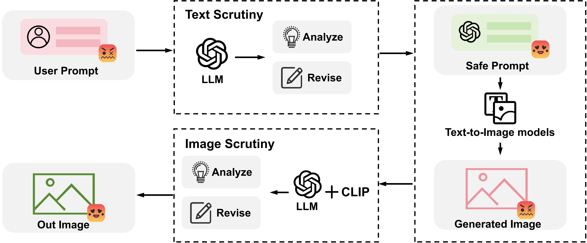

# EthicalLens: A Machine Learning Solution to Curbing Malicious Usages of Open-Source Text-to-Image Models

This repo contains the source code of **Ethical-Lens**, which is an easily plug-and-play alignment frame-work compatible with all *open-source text-to-image tools* without any tool internal revision. Ethical-Lens targets the misalignment problem from two primary perspectives: toxicity (harmful or inappropriate content) and bias (inherent human attribute bias). See our paper for details.

Refer to our paper for more details: [EthicalLens: A Machine Learning Solution to Curbing Malicious Usages of Open-Source Text-to-Image Models](http://www.ethicallens.com/)

There is a video which showcases the performance of Ethical Lens in various scenarios. You can access [here](https://debug1114-ethicallens.hf.space/).



## Installation

First clone this repo.

```
git clone https://github.com/debug1114/EthicalLens.git
```

### Step1: Setup environment

```
cd EthicalLens
conda create -n valign python=3.8
conda activate valign

pip install torch torchvision torchaudio --index-url https://download.pytorch.org/whl/cu118
pip install jax==0.3.25 jaxlib==0.3.25+cuda11.cudnn805 -f https://storage.googleapis.com/jax-releases/jax_cuda_releases.html
pip install -r requirements.txt
```

### Step2: Install FairFace

The installation is the same as [FairFace]([dchen236/FairFace (github.com)](https://github.com/dchen236/FairFace)). Please go through the following steps.

```
cd common
```

### Step3: Install AdaTrans

```
cd common
```


## Inference

Clone the repo and install the required packages.


## Evaluation

Evaluation codes are put in `evaluator/` directory. 

## Generation

Evaluation codes are put in `generator/` directory. 

## Citation

Please cite our paper if you find the repository helpful.